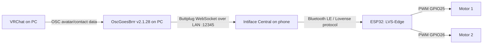

# Mellish's VRC Haptics

DIY two-channel VRChat haptics using an ESP32, two vibration motor driver
modules, an OLED, OscGoesBrrr, and Intiface Central.

## Current verified milestone

As of 20 August 2026, the ESP32 firmware:

- advertises over Bluetooth Low Energy as `LVS-Edge`;
- is discovered by Intiface as a Lovense Edge;
- appears as one Intiface device with two vibration outputs;
- maps output 0 to GPIO25 and output 1 to GPIO26;
- preserves independent startup calibration (`70` and `75` PWM);
- displays connection state and both 0–20 levels on a 128×32 OLED; and
- stops both motors whenever the BLE connection drops.

Discovery, BLE connection, Lovense identification, and the two-output device
definition are verified. End-to-end VRChat contact mapping and final motor
threshold calibration remain to be tested.

## Signal path

USB is used for firmware upload, Serial Monitor, and optionally power. It is
not part of the runtime control path.

## Hardware

- ESP32-WROOM-32 development board (`ESP32 Dev Module`)
- SSD1306 128×32 I²C OLED at address `0x3C`
- two vibration motors, each connected through its own driver module
- suitable regulated motor supply with a common ground

See [docs/wiring.md](docs/wiring.md) before powering motors.

## Arduino setup

1. Install the Espressif ESP32 Arduino board package.
2. Select **ESP32 Dev Module**.
3. Install **Adafruit GFX Library** and **Adafruit SSD1306**.
4. Open `firmware/Mellish_VRC_Haptics/Mellish_VRC_Haptics.ino`.
5. Upload and open Serial Monitor at `115200` baud.
6. Follow [docs/intiface-setup.md](docs/intiface-setup.md).

The BLE classes used by the sketch are supplied by the ESP32 board package.
No Wi-Fi credentials or WebSocket library are required by the ESP32 firmware.

## Documentation

- [Architecture and protocol](docs/architecture.md)
- [Wiring and pinout](docs/wiring.md)
- [Intiface and OGB setup](docs/intiface-setup.md)
- [VRChat setup](docs/vrchat-setup.md)
- [Troubleshooting](docs/troubleshooting.md)
- [Verified checkpoint](docs/verified-checkpoint.md)

## Safety

Never drive a motor directly from an ESP32 pin. Bench-test with suitable driver
modules and a correctly sized supply. Keep all grounds common, disconnect motor
power while changing wiring, and stop if any component becomes warm.

## License

Licensed under the [MIT License](LICENSE).
