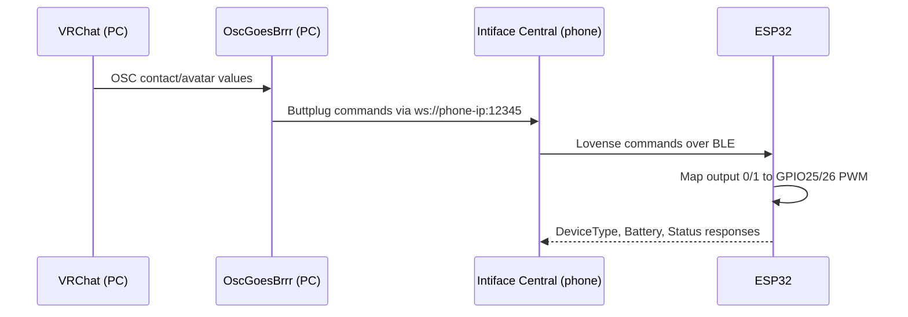

# Architecture and protocol

## Runtime architecture

The ESP32 does not parse VRChat OSC. OGB interprets VRChat data and controls
Intiface. Intiface translates Buttplug output commands into Lovense BLE traffic.

## BLE identity

| Property | Value |
|---|---|
| Advertised name | `LVS-Edge` |
| Emulated model | Lovense Edge (`P`) |
| Stable logical address | `MELLISH-HAPTICS-001` |
| BLE service | `50300001-0023-4bd4-bbd5-a6920e4c5653` |
| Command/write characteristic | `50300002-0023-4bd4-bbd5-a6920e4c5653` |
| Response/read-notify characteristic | `50300003-0023-4bd4-bbd5-a6920e4c5653` |

The firmware uses a stable locally administered base MAC. This deliberately
differs from the address used by the earlier BLE diagnostic sketch, preventing
Android from reusing a stale bonded GATT-service cache.

## Lovense commands

| Command | Firmware behavior |
|---|---|
| `DeviceType;` | Replies `P:1:MELLISH-HAPTICS-001;` |
| `Battery;` | Replies `100;` (wired prototype placeholder) |
| `Status:1;` | Replies `2;` |
| `Vibrate1:n;` | Sets Motor 1 / GPIO25, with `n` clamped to 0–20 |
| `Vibrate2:n;` | Sets Motor 2 / GPIO26, with `n` clamped to 0–20 |
| `Vibrate:n;` | Compatibility fallback that sets both motors |
| `PowerOff;` | Stops both motors and replies `OK;` |

## Calibrated PWM mapping

Level 0 always produces PWM 0. Levels 1–20 are linearly mapped from each
motor's independent minimum usable PWM to 255.

| Lovense level | Motor 1 PWM (minimum 70) | Motor 2 PWM (minimum 75) |
|---:|---:|---:|
| 0 | 0 | 0 |
| 1 | 70 | 75 |
| 10 | 157 | 160 |
| 20 | 255 | 255 |

## Safety behavior

- Both outputs start at zero.
- BLE disconnection immediately sets both outputs to zero.
- Values are clamped to the Lovense 0–20 range.
- Each channel updates independently for `Vibrate1` and `Vibrate2`.
- The OLED is optional; failure to detect it does not disable the motor
  failsafe or Serial diagnostics.
