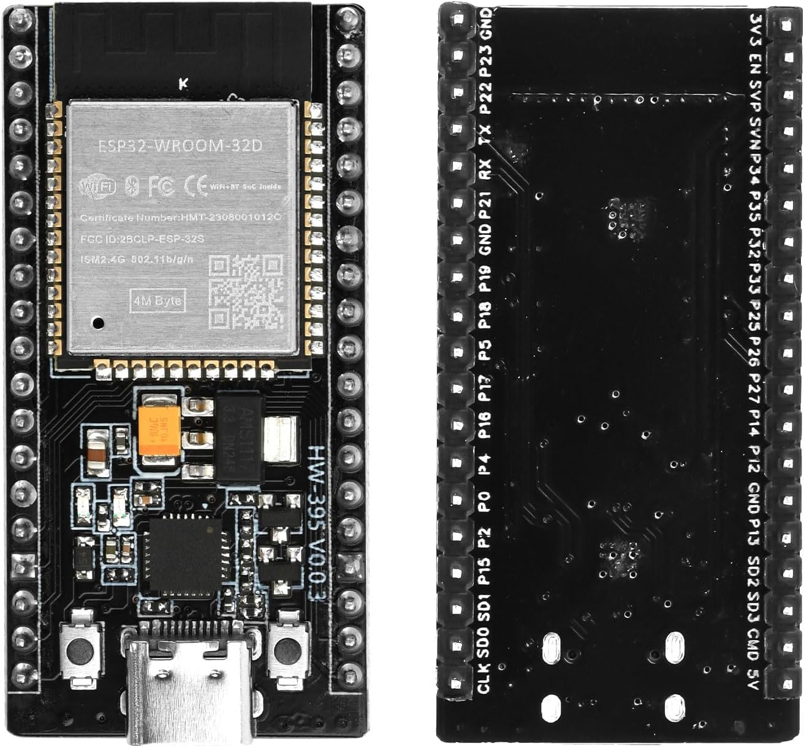
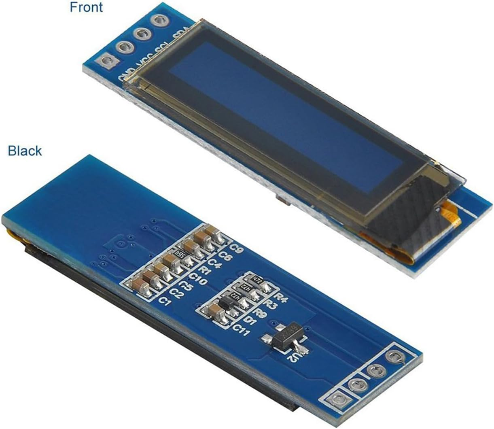
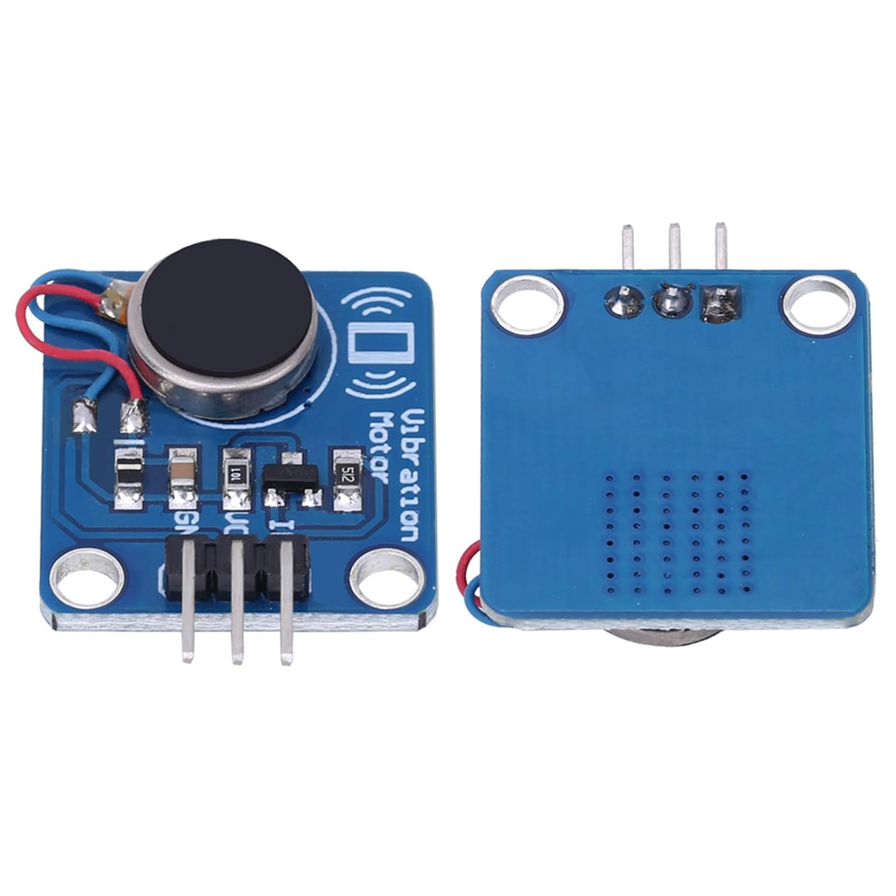

# Wiring and pinout

## Component references

### ESP32-WROOM-32 development board



The reference board uses an ESP32-WROOM-32D module and USB-C connector. Check
the silkscreen on the actual board when locating GPIO21, GPIO22, GPIO25,
GPIO26, 3.3 V, 5 V, and GND.

### SSD1306 128×32 I²C OLED



The pictured four-pin module is labelled `GND`, `VCC`, `SCL`, and `SDA`.

### Vibration motor module



The pictured module has `GND`, `VCC`, and signal/input pins. Verify the labels
on each physical module before applying power; product revisions can differ.

## Pin table

| ESP32 connection | Destination | Purpose |
|---|---|---|
| GPIO21 | OLED SDA | I²C data |
| GPIO22 | OLED SCL | I²C clock |
| 3.3 V | OLED VCC | OLED power |
| GND | OLED GND | Common ground |
| GPIO25 | Motor 1 driver IN | PWM control for Intiface output 0 |
| GPIO26 | Motor 2 driver IN | PWM control for Intiface output 1 |
| GND | Both motor-driver GND pins | Common signal/power reference |
| Regulated motor supply + | Both driver VCC pins | Motor power, normally 5 V for the tested modules |

## Wiring diagram

```text
                         SSD1306 128x32
                    +--------------------+
ESP32 3V3 ----------| VCC                |
ESP32 GND ----------| GND                |
ESP32 GPIO21 -------| SDA                |
ESP32 GPIO22 -------| SCL                |
                    +--------------------+

ESP32 GPIO25 ----------------> IN   Motor driver 1 ----> Motor 1
ESP32 GPIO26 ----------------> IN   Motor driver 2 ----> Motor 2
ESP32 GND --------------------> GND  both motor drivers
Motor supply + --------------> VCC  both motor drivers
Motor supply - --------------> GND  common ground
```

Do not connect a motor or driver VCC pin to GPIO25 or GPIO26. Those GPIOs are
control signals only.

## Electrical checks

1. Disconnect motor power before changing wiring.
2. Confirm both driver modules accept 3.3 V logic on `IN`.
3. Confirm the motor supply is rated for both startup currents simultaneously.
4. Join the supply negative terminal to ESP32 GND.
5. Initially test each channel separately at levels 0 and 1.
6. Stop immediately if the ESP32 resets, the OLED glitches, or anything heats.

The firmware assumes an active-high driver input and 20 kHz, 8-bit PWM.
