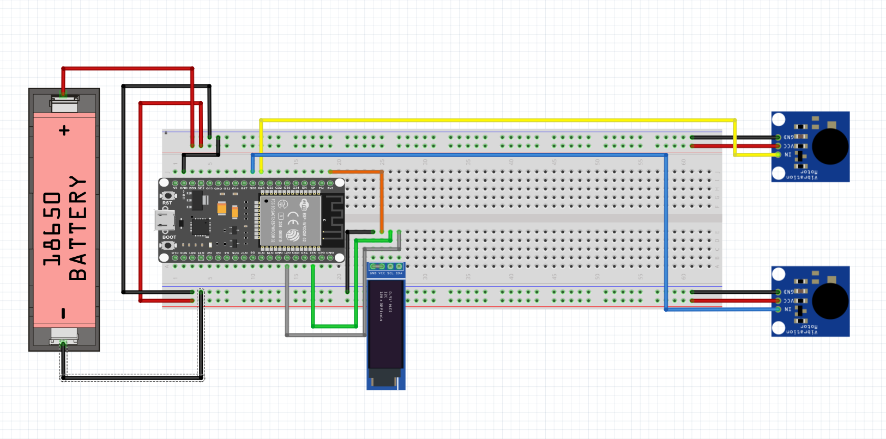

# Two-channel wiring and pinout

## Connections

| ESP32 connection | Destination | Purpose |
|---|---|---|
| GPIO21 | OLED SDA | I²C data |
| GPIO22 | OLED SCL | I²C clock |
| 3.3 V | OLED VCC | OLED power |
| GND | OLED GND | Common ground |
| GPIO25 | Motor 1 driver input | PWM control for Intiface output 0 |
| GPIO26 | Motor 2 driver input | PWM control for Intiface output 1 |
| GND | Both motor-driver grounds | Common signal/power reference |
| Rated motor supply + | Both driver motor-power inputs | Motor power appropriate to the motor modules |

The diagram is a build reference; verify every physical module's printed pin
labels before applying power. Shared component photographs are in the
[repository image gallery](../../../images/README.md).

## Larger motors and external controllers

Each GPIO signal may control the logic input of a suitably rated external
MOSFET circuit or motor controller instead of the small motor module. GPIO25
and GPIO26 must remain signal connections only—never drive any motor directly
from an ESP32 GPIO.

Larger motors require their own correctly rated regulated supply, a driver with
adequate voltage/current and thermal ratings, and appropriate protection such
as flyback suppression where the chosen motor/driver requires it. Connect the
external supply ground, controller ground, and ESP32 ground together so the
control signals have a common reference. Confirm that the controller accepts
3.3 V logic.

## Electrical checks

1. Disconnect motor power before changing wiring.
2. Confirm both driver inputs accept 3.3 V logic and are active high.
3. Confirm the supply supports both motors' startup current simultaneously.
4. Join the motor-supply negative terminal to ESP32 GND.
5. Initially test each channel separately at levels `0` and `1`.
6. Stop immediately if the ESP32 resets, the OLED glitches, or anything heats.

The verified firmware uses active-high 20 kHz, 8-bit PWM.
